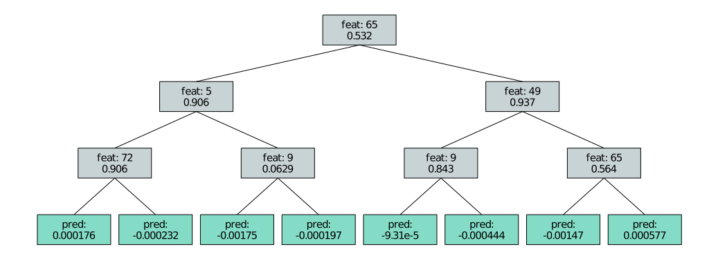

# EvoTrees <a href="https://evovest.github.io/EvoTrees.jl/dev/"></a>


| Documentation | CI Status | DOI |
|:------------------------:|:----------------:|:----------------:|
| [![][docs-stable-img]][docs-stable-url] [![][docs-latest-img]][docs-latest-url] | [![][ci-img]][ci-url] | [![][DOI-img]][DOI-url] |

[docs-latest-img]: https://img.shields.io/badge/docs-latest-blue.svg
[docs-latest-url]: https://evovest.github.io/EvoTrees.jl/dev

[docs-stable-img]: https://img.shields.io/badge/docs-stable-blue.svg
[docs-stable-url]: https://evovest.github.io/EvoTrees.jl/stable

[ci-img]: https://github.com/Evovest/EvoTrees.jl/workflows/CI/badge.svg
[ci-url]: https://github.com/Evovest/EvoTrees.jl/actions?query=workflow%3ACI+branch%3Amain

[DOI-img]: https://zenodo.org/badge/164559537.svg
[DOI-url]: https://zenodo.org/doi/10.5281/zenodo.10569604

A Julia implementation of boosted trees with CPU and GPU support.
Efficient histogram based algorithms with support for multiple loss functions (notably multi-target objectives such as max likelihood methods).

[R binding available](https://github.com/Evovest/EvoTrees).


## Installation

Latest:

```julia-repl
julia> Pkg.add(url="https://github.com/Evovest/EvoTrees.jl")
```

From General Registry:

```julia-repl
julia> Pkg.add("EvoTrees")
```

## Performance

Data consists of randomly generated `Matrix{Float64}`. Training is performed on 200 iterations.  
Code to reproduce is available in [`benchmarks/regressor.jl`](https://github.com/Evovest/EvoTrees.jl/blob/main/benchmarks/regressor.jl). 

- Run Environment:
    - CPU: 12 threads on AMD Ryzen 5900X
    - GPU: NVIDIA RTX A4000
    - Julia: v1.10.8
- Package versions:
    - EvoTrees: v0.18.3
    - XGBoost: v3.1.2 (Using the `hist` algorithm)

### CPU:

| **nobs** | **nfeats** | **max\_depth** | **train\_evo** | **infer\_evo** | **train\_xgb** | **infer\_xgb** |
|:--------:|:----------:|:--------------:|:--------------:|:--------------:|:--------------:|:--------------:|
|   100k   |     10     |       6        |      0.36      |      0.06      |      0.21      |      0.03      |
|   100k   |     10     |       11       |      1.28      |      0.08      |      0.63      |      0.06      |
|   100k   |    100     |       6        |      0.79      |      0.08      |      0.79      |      0.03      |
|   100k   |    100     |       11       |      4.91      |      0.12      |      3.67      |      0.07      |
|    1M    |     10     |       6        |      2.49      |      0.31      |      1.60      |      0.24      |
|    1M    |     10     |       11       |      5.07      |      0.63      |      3.16      |      0.58      |
|    1M    |    100     |       6        |      5.82      |      0.69      |      5.53      |      0.26      |
|    1M    |    100     |       11       |     18.78      |      1.19      |     13.40      |      0.57      |
|   10M    |     10     |       6        |     26.45      |      3.34      |     30.99      |      1.76      |
|   10M    |     10     |       11       |     51.88      |      6.27      |     55.20      |      5.57      |
|   10M    |    100     |       6        |     85.05      |      6.44      |     65.90      |      2.56      |
|   10M    |    100     |       11       |     192.58     |     12.18      |     111.69     |      6.02      |

### GPU:

| **nobs** | **nfeats** | **max\_depth** | **train\_evo** | **infer\_evo** | **train\_xgb** | **infer\_xgb** |
|:--------:|:----------:|:--------------:|:--------------:|:--------------:|:--------------:|:--------------:|
|   100k   |     10     |       6        |      0.66      |      0.01      |      0.24      |      0.00      |
|   100k   |     10     |       11       |      1.43      |      0.01      |      1.12      |      0.01      |
|   100k   |    100     |       6        |      0.93      |      0.03      |      0.47      |      0.03      |
|   100k   |    100     |       11       |      2.17      |      0.03      |      2.92      |      0.06      |
|    1M    |     10     |       6        |      1.37      |      0.05      |      0.58      |      0.03      |
|    1M    |     10     |       11       |      2.45      |      0.05      |      2.14      |      0.04      |
|    1M    |    100     |       6        |      2.77      |      0.30      |      2.30      |      0.28      |
|    1M    |    100     |       11       |      5.07      |      0.32      |      6.80      |      0.58      |
|   10M    |     10     |       6        |      7.53      |      0.44      |      3.83      |      0.18      |
|   10M    |     10     |       11       |     12.60      |      0.53      |      8.66      |      0.31      |
|   10M    |    100     |       6        |     21.93      |      3.33      |     21.42      |      2.88      |
|   10M    |    100     |       11       |     37.25      |      3.57      |     41.98      |      5.91      |

## MLJ Integration

See [official project page](https://github.com/alan-turing-institute/MLJ.jl) for more info.

## Quick start with internal API

A model configuration must first be defined, using one of the model constructor:
- `EvoTreeRegressor`
- `EvoTreeClassifier`
- `EvoTreeCount`
- `EvoTreeMLE`

Model training is performed using `fit`. 
It supports additional keyword arguments to track evaluation metric and perform early stopping. 
Look at the docs for more details on available hyper-parameters for each of the above constructors and other options training options.

### Matrix features input

```julia
using EvoTrees
using EvoTrees: fit

config = EvoTreeRegressor(
    loss=:mse, 
    nrounds=100, 
    max_depth=6,
    nbins=32,
    eta=0.1)

x_train, y_train = rand(1_000, 10), rand(1_000)
m = fit(config; x_train, y_train)
preds = m(x_train)
```

### DataFrames input

When using a DataFrames as input, features with elements types `Real` (incl. `Bool`) and `Categorical` are automatically recognized as input features. Alternatively, `fnames` kwarg can be used to specify the variables to be used as features. 

`Categorical` features are treated accordingly by the algorithm: ordered variables are treated as numerical features, using `≤` split rule, while unordered variables are using `==`. Support is currently limited to a maximum of 255 levels. `Bool` variables are treated as unordered, 2-levels categorical variables.

```julia
dtrain = DataFrame(x_train, :auto)
dtrain.y .= y_train
m = fit(config, dtrain; target_name="y");
m = fit(config, dtrain; target_name="y", fnames=["x1", "x3"]);
```

## Shap

EvoTrees includes a Julia implementation of Linear TreeShap by Yu et al. (2022). 
It computes exact Shapley values for decision trees in O(LD) time.

```julia
shap_effects = EvoTrees.shap(m, dtrain)
```

#### Reference

Peng Yu, Chao Xu, Albert Bifet, Jesse Read Linear Tree Shap (2022). In [Proceedings of 36th Conference on Neural Information Processing Systems](https://openreview.net/forum?id=OzbkiUo24g).

## Feature importance

Returns the normalized gain by feature.

```julia
features_gain = EvoTrees.importance(m)
```

## Plot

Plot a model *ith* tree (first *actual* tree is #2 as 1st *tree* is reserved to set the model's bias):

```julia
plot(m, 2)
```




## Save/Load

```julia
EvoTrees.save(m, "data/model.bson")
m = EvoTrees.load("data/model.bson");
```
