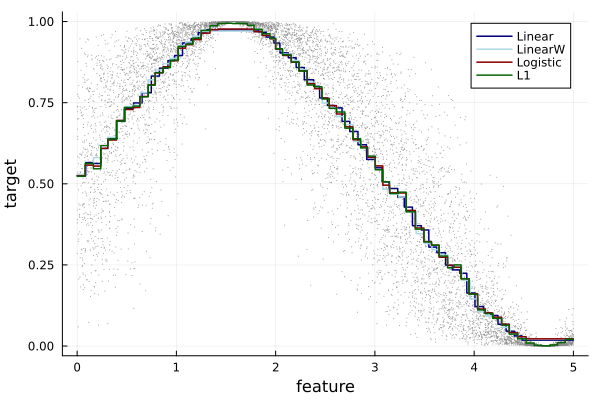
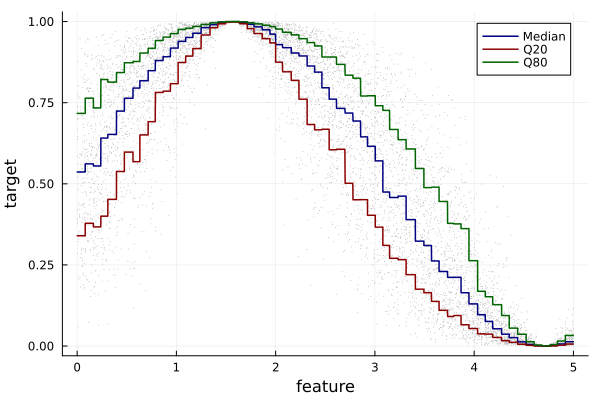
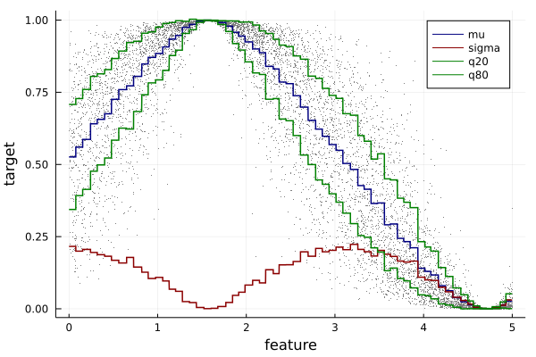

# EvoTrees

[](https://travis-ci.org/Evovest/EvoTrees.jl)
[](https://github.com/Evovest/EvoTrees.jl/actions)
[](https://Evovest.github.io/EvoTrees.jl/stable)
[](https://Evovest.github.io/EvoTrees.jl/dev)

A Julia implementation of boosted trees with CPU and GPU support.
Efficient histogram based algorithms with support for multiple loss functions (notably multi-target objectives such as max likelihood methods).

[R binding available](https://github.com/Evovest/EvoTrees).

Input features are expected to be `Matrix{Float64/Float32}`. Tables/DataFrames format can be handled through [MLJ](https://github.com/alan-turing-institute/MLJ.jl) (see [below](#mlj-integration)).

## Supported tasks

### CPU

- linear
- logistic
- Poisson
- L1 (mae regression)
- Quantile
- multiclassification (softmax)
- Gaussian (max likelihood)

Set parameter `device="cpu"`.

### GPU

- linear
- logistic
- Gaussian (max likelihood)

Set parameter `device="gpu"`.

## Installation

Latest:

```julia-repl
julia> Pkg.add("https://github.com/Evovest/EvoTrees.jl")
```

Official Repo:

```julia-repl
julia> Pkg.add("EvoTrees")
```

## Performance

Data consists of randomly generated float32. Training is performed on 200 iterations. Code to reproduce is [here](https://github.com/Evovest/EvoTrees.jl/blob/master/experiments/benchmarks_v2.jl). 

EvoTrees: v0.8.4
XGBoost: v1.1.1

CPU: 16 threads on AMD Threadripper 3970X
GPU: NVIDIA RTX 2080

### Training: 

| Dimensions   / Algo | XGBoost Hist | EvoTrees | EvoTrees GPU |
|---------------------|:------------:|:--------:|:------------:|
| 100K x 100          |     1.10s    |   1.80s  |     3.14s    |
| 500K x 100          |     4.83s    |   4.98s  |     4.98s    |
| 1M x 100            |     9.84s    |   9.89s  |     7.37s    |
| 5M x 100            |     45.5s    |   53.8s  |     25.8s    |

### Inference:

| Dimensions   / Algo | XGBoost Hist | EvoTrees | EvoTrees GPU |
|---------------------|:------------:|:--------:|:------------:|
| 100K x 100          |    0.164s    |  0.026s  |    0.013s    |
| 500K x 100          |    0.796s    |  0.175s  |    0.055s    |
| 1M x 100            |     1.59s    |  0.396s  |    0.108s    |
| 5M x 100            |     7.96s    |   2.15s  |    0.543s    |

## Parameters

  - **loss**: {:linear, :logistic, :poisson, :L1, :quantile, :softmax, :gaussian}
  - **device**: {"cpu", "gpu"}
  - **nrounds**: integer, default=10
  - **λ**: L2 regularization, float, default=0.0
  - **γ**: min gain for split, default=0.0
  - **η**: learning rate, default=0.1
  - **max\_depth**: integer, default=5
  - **min\_weight**: float \>= 0 default=1.0
  - **rowsample**: float \[0,1\] default=1.0
  - **colsample**: float \[0,1\] default=1.0
  - **nbins**: Int, number of bins into which features will be quantilized default=64
  - **α**: float \[0,1\], set the quantile or bias in L1 default=0.5
  - **metric**: {:mse, :rmse, :mae, :logloss, :quantile, :gini, :gaussian, :none},  default=:none
  - **rng**: random controller, either a `Random.AbstractRNG` or an `Int` acting as a seed. Default=123.


## MLJ Integration

See [official project page](https://github.com/alan-turing-institute/MLJ.jl) for more info.

```julia
using StatsBase: sample
using EvoTrees
using EvoTrees: sigmoid, logit
using MLJBase

features = rand(10_000) .* 5 .- 2
X = reshape(features, (size(features)[1], 1))
Y = sin.(features) .* 0.5 .+ 0.5
Y = logit(Y) + randn(size(Y))
Y = sigmoid(Y)
y = Y
X = MLJBase.table(X)

# @load EvoTreeRegressor
# linear regression
tree_model = EvoTreeRegressor(loss=:linear, max_depth=5, η=0.05, nrounds=10)

# set machine
mach = machine(tree_model, X, y)

# partition data
train, test = partition(eachindex(y), 0.7, shuffle=true); # 70:30 split

# fit data
fit!(mach, rows=train, verbosity=1)

# continue training
mach.model.nrounds += 10
fit!(mach, rows=train, verbosity=1)

# predict on train data
pred_train = predict(mach, selectrows(X, train))
mean(abs.(pred_train - selectrows(Y, train)))

# predict on test data
pred_test = predict(mach, selectrows(X, test))
mean(abs.(pred_test - selectrows(Y, test)))
```


## Getting started using internal API

Minimal example to fit a noisy sinus wave.



```julia
using EvoTrees
using EvoTrees: sigmoid, logit

# prepare a dataset
features = rand(10000) .* 20 .- 10
X = reshape(features, (size(features)[1], 1))
Y = sin.(features) .* 0.5 .+ 0.5
Y = logit(Y) + randn(size(Y))
Y = sigmoid(Y)
𝑖 = collect(1:size(X, 1))

# train-eval split
𝑖_sample = sample(𝑖, size(𝑖, 1), replace = false)
train_size = 0.8
𝑖_train = 𝑖_sample[1:floor(Int, train_size * size(𝑖, 1))]
𝑖_eval = 𝑖_sample[floor(Int, train_size * size(𝑖, 1))+1:end]

X_train, X_eval = X[𝑖_train, :], X[𝑖_eval, :]
Y_train, Y_eval = Y[𝑖_train], Y[𝑖_eval]

params1 = EvoTreeRegressor(
    loss=:linear, metric=:mse,
    nrounds=100, nbins = 100,
    λ = 0.5, γ=0.1, η=0.1,
    max_depth = 6, min_weight = 1.0,
    rowsample=0.5, colsample=1.0)
model = fit_evotree(params1, X_train, Y_train, X_eval = X_eval, Y_eval = Y_eval, print_every_n = 25)
pred_eval_linear = predict(model, X_eval)

# logistic / cross-entropy
params1 = EvoTreeRegressor(
    loss=:logistic, metric = :logloss,
    nrounds=100, nbins = 100,
    λ = 0.5, γ=0.1, η=0.1,
    max_depth = 6, min_weight = 1.0,
    rowsample=0.5, colsample=1.0)
model = fit_evotree(params1, X_train, Y_train, X_eval = X_eval, Y_eval = Y_eval, print_every_n = 25)
pred_eval_logistic = predict(model, X_eval)

# Poisson
params1 = EvoTreeCount(
    loss=:poisson, metric = :poisson,
    nrounds=100, nbins = 100,
    λ = 0.5, γ=0.1, η=0.1,
    max_depth = 6, min_weight = 1.0,
    rowsample=0.5, colsample=1.0)
model = fit_evotree(params1, X_train, Y_train, X_eval = X_eval, Y_eval = Y_eval, print_every_n = 25)
@time pred_eval_poisson = predict(model, X_eval)

# L1
params1 = EvoTreeRegressor(
    loss=:L1, α=0.5, metric = :mae,
    nrounds=100, nbins=100,
    λ = 0.5, γ=0.0, η=0.1,
    max_depth = 6, min_weight = 1.0,
    rowsample=0.5, colsample=1.0)
model = fit_evotree(params1, X_train, Y_train, X_eval = X_eval, Y_eval = Y_eval, print_every_n = 25)
pred_eval_L1 = predict(model, X_eval)
```

## Quantile Regression



```julia
# q50
params1 = EvoTreeRegressor(
    loss=:quantile, α=0.5, metric = :quantile,
    nrounds=200, nbins = 100,
    λ = 0.1, γ=0.0, η=0.05,
    max_depth = 6, min_weight = 1.0,
    rowsample=0.5, colsample=1.0)
model = fit_evotree(params1, X_train, Y_train, X_eval = X_eval, Y_eval = Y_eval, print_every_n = 25)
pred_train_q50 = predict(model, X_train)

# q20
params1 = EvoTreeRegressor(
    loss=:quantile, α=0.2, metric = :quantile,
    nrounds=200, nbins = 100,
    λ = 0.1, γ=0.0, η=0.05,
    max_depth = 6, min_weight = 1.0,
    rowsample=0.5, colsample=1.0)
model = fit_evotree(params1, X_train, Y_train, X_eval = X_eval, Y_eval = Y_eval, print_every_n = 25)
pred_train_q20 = predict(model, X_train)

# q80
params1 = EvoTreeRegressor(
    loss=:quantile, α=0.8,
    nrounds=200, nbins = 100,
    λ = 0.1, γ=0.0, η=0.05,
    max_depth = 6, min_weight = 1.0,
    rowsample=0.5, colsample=1.0)
model = fit_evotree(params1, X_train, Y_train, X_eval = X_eval, Y_eval = Y_eval, print_every_n = 25)
pred_train_q80 = predict(model, X_train)
```

## Gaussian Max Likelihood



```julia
params1 = EvoTreeGaussian(
    loss=:gaussian, metric=:gaussian,
    nrounds=100, nbins=100,
    λ = 0.0, γ=0.0, η=0.1,
    max_depth = 6, min_weight = 1.0,
    rowsample=0.5, colsample=1.0, seed=123)
```

## Feature importance

Returns the normalized gain by feature.

```julia
features_gain = importance(model, var_names)
```

## Plot

Plot a given tree of the model:

```julia
plot(model, 2)
```


Note that 1st tree is used to set the bias so the first real tree is #2.

## Save/Load

```julia
EvoTrees.save(model, "data/model.bson")
model = EvoTrees.load("data/model.bson");
```