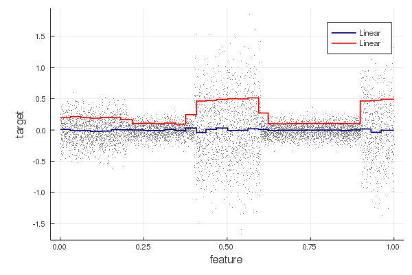
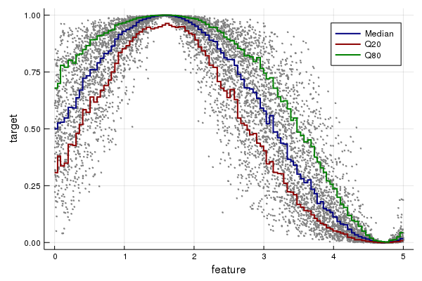

# EvoTrees

[](https://travis-ci.org/Evovest/EvoTrees.jl)

A Julia implementation of boosted trees.  

Currently supports linear, logistic, Poisson, Quantile and robust (L1) regression.

### Installation

```julia-repl
julia> Pkg.add("https://github.com/Evovest/EvoTrees.jl")
```

### Parameters

  - loss: {:linear, :logistic, :poisson, :L1, :quantile}
  - nrounds: 10L
  - λ: 0.0
  - γ: 0.0
  - η: 0.1
  - max\_depth: integer, default 5L
  - min\_weight: float \>= 0 default=1.0,
  - rowsample: float \[0,1\] default=1.0
  - colsample: float \[0,1\] default=1.0
  - nbins: Int, number of bins into which features will be quantilized default=64
  - α: float \[0,1\], set the quantile or bias in L1 default=0.5
  - metric: {:mse, :rmse, :mae, :logloss, :quantile},  default=:none

### Getting started

Minimal example to fit a noisy sinus wave.



```julia
using EvoTrees
using EvoTrees: sigmoid, logit

# prepare a dataset
features = rand(10000) .* 20 .- 10
X = reshape(features, (size(features)[1], 1))
Y = sin.(features) .* 0.5 .+ 0.5
Y = logit(Y) + randn(size(Y))
Y = sigmoid(Y)
𝑖 = collect(1:size(X,1))

# train-eval split
𝑖_sample = sample(𝑖, size(𝑖, 1), replace = false)
train_size = 0.8
𝑖_train = 𝑖_sample[1:floor(Int, train_size * size(𝑖, 1))]
𝑖_eval = 𝑖_sample[floor(Int, train_size * size(𝑖, 1))+1:end]

X_train, X_eval = X[𝑖_train, :], X[𝑖_eval, :]
Y_train, Y_eval = Y[𝑖_train], Y[𝑖_eval]

params1 = EvoTreeRegressor(
    loss=:linear, metric=:mse,
    nrounds=100, nbins = 100,
    λ = 0.5, γ=0.1, η=0.1,
    max_depth = 6, min_weight = 1.0,
    rowsample=0.5, colsample=1.0)
model = grow_gbtree(X_train, Y_train, params1, X_eval = X_eval, Y_eval = Y_eval, print_every_n = 25)
pred_eval_linear = predict(model, X_eval)

# logistic / cross-entropy
params1 = EvoTreeRegressor(
    loss=:logistic, metric = :logloss,
    nrounds=100, nbins = 100,
    λ = 0.5, γ=0.1, η=0.1,
    max_depth = 6, min_weight = 1.0,
    rowsample=0.5, colsample=1.0)
model = grow_gbtree(X_train, Y_train, params1, X_eval = X_eval, Y_eval = Y_eval, print_every_n = 25)
pred_eval_logistic = predict(model, X_eval)

# Poisson
params1 = EvoTreeRegressor(
    loss=:poisson, metric = :logloss,
    nrounds=100, nbins = 100,
    λ = 0.5, γ=0.1, η=0.1,
    max_depth = 6, min_weight = 1.0,
    rowsample=0.5, colsample=1.0)
model = grow_gbtree(X_train, Y_train, params1, X_eval = X_eval, Y_eval = Y_eval, print_every_n = 25)
@time pred_eval_poisson = predict(model, X_eval)

# L1
params1 = EvoTreeRegressor(
    loss=:L1, α=0.5, metric = :mae,
    nrounds=100, nbins=100,
    λ = 0.5, γ=0.0, η=0.1,
    max_depth = 6, min_weight = 1.0,
    rowsample=0.5, colsample=1.0)
model = grow_gbtree(X_train, Y_train, params1, X_eval = X_eval, Y_eval = Y_eval, print_every_n = 25)
pred_eval_L1 = predict(model, X_eval)
```




```julia
# q50
params1 = EvoTreeRegressor(
    loss=:quantile, α=0.5, metric = :quantile,
    nrounds=200, nbins = 100,
    λ = 0.1, γ=0.0, η=0.05,
    max_depth = 6, min_weight = 1.0,
    rowsample=0.5, colsample=1.0)

model = grow_gbtree(X_train, Y_train, params1, X_eval = X_eval, Y_eval = Y_eval, print_every_n = 25)
pred_train_q50 = predict(model, X_train)

# q20
params1 = EvoTreeRegressor(
    loss=:quantile, α=0.2, metric = :quantile,
    nrounds=200, nbins = 100,
    λ = 0.1, γ=0.0, η=0.05,
    max_depth = 6, min_weight = 1.0,
    rowsample=0.5, colsample=1.0)
model = grow_gbtree(X_train, Y_train, params1, X_eval = X_eval, Y_eval = Y_eval, print_every_n = 25)
pred_train_q20 = predict(model, X_train)

# q80
params1 = EvoTreeRegressor(
    loss=:quantile, α=0.8,
    nrounds=200, nbins = 100,
    λ = 0.1, γ=0.0, η=0.05,
    max_depth = 6, min_weight = 1.0,
    rowsample=0.5, colsample=1.0)
model = grow_gbtree(X_train, Y_train, params1, X_eval = X_eval, Y_eval = Y_eval, print_every_n = 25)
pred_train_q80 = predict(model, X_train)
```
