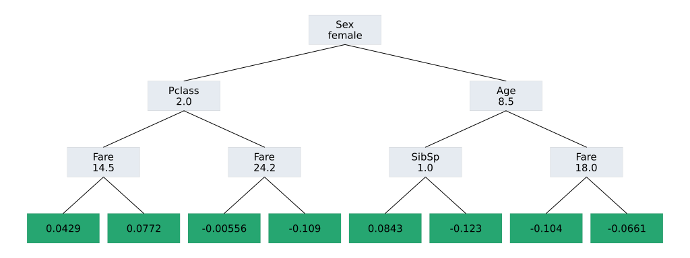

# EvoTrees <a href="https://evovest.github.io/EvoTrees.jl/dev/"></a>


| Documentation | CI Status | DOI |
|:------------------------:|:----------------:|:----------------:|
| [![][docs-stable-img]][docs-stable-url] [![][docs-latest-img]][docs-latest-url] | [![][ci-img]][ci-url] | [![][DOI-img]][DOI-url] |

[docs-latest-img]: https://img.shields.io/badge/docs-latest-blue.svg
[docs-latest-url]: https://evovest.github.io/EvoTrees.jl/dev

[docs-stable-img]: https://img.shields.io/badge/docs-stable-blue.svg
[docs-stable-url]: https://evovest.github.io/EvoTrees.jl/stable

[ci-img]: https://github.com/Evovest/EvoTrees.jl/workflows/CI/badge.svg
[ci-url]: https://github.com/Evovest/EvoTrees.jl/actions?query=workflow%3ACI+branch%3Amain

[DOI-img]: https://zenodo.org/badge/164559537.svg
[DOI-url]: https://zenodo.org/doi/10.5281/zenodo.10569604

A Julia implementation of boosted trees with CPU and GPU support.
Efficient histogram based algorithms with support for multiple loss functions (notably multi-target objectives such as max likelihood methods).

[R binding available](https://github.com/Evovest/EvoTrees).


## Installation

Latest:

```julia-repl
julia> Pkg.add(url="https://github.com/Evovest/EvoTrees.jl")
```

From General Registry:

```julia-repl
julia> Pkg.add("EvoTrees")
```

## Performance

Data consists of randomly generated `Matrix{Float64}`. Training is performed on 200 iterations.  
Code to reproduce is available in [`benchmarks/regressor.jl`](https://github.com/Evovest/EvoTrees.jl/blob/main/benchmarks/regressor.jl). 

- Run Environment:
    - CPU: 12 threads on AMD Ryzen 5900X
    - GPU: NVIDIA RTX A4000
    - Julia: v1.10.8
- Algorithms
    - XGBoost: v2.5.1 (Using the `hist` algorithm)
    - EvoTrees: v0.17.1

### CPU:

| **nobs** | **nfeats** | **max\_depth** | **train\_evo** | **train\_xgb** | **infer\_evo** | **infer\_xgb** |
|:--------:|:----------:|:--------------:|:--------------:|:--------------:|:--------------:|:--------------:|
| 100k     | 10         | 6              | 0.36           | 0.68           | 0.05           | 0.03           |
| 100k     | 10         | 11             | 1.19           | 1.06           | 0.08           | 0.06           |
| 100k     | 100        | 6              | 0.83           | 1.31           | 0.07           | 0.15           |
| 100k     | 100        | 11             | 3.43           | 3.33           | 0.10           | 0.17           |
| 1M       | 10         | 6              | 2.20           | 6.02           | 0.28           | 0.29           |
| 1M       | 10         | 11             | 4.75           | 7.89           | 0.81           | 0.62           |
| 1M       | 100        | 6              | 5.50           | 13.57          | 0.68           | 1.30           |
| 1M       | 100        | 11             | 15.72          | 18.79          | 1.23           | 1.86           |
| 10M      | 10         | 6              | 25.31          | 80.07          | 3.74           | 2.73           |
| 10M      | 10         | 11             | 50.23          | 109.67         | 6.07           | 6.19           |
| 10M      | 100        | 6              | 83.70          | 147.04         | 6.18           | 14.05          |
| 10M      | 100        | 11             | 191.01         | 189.04         | 11.49          | 17.09          |

### GPU:

| **nobs** | **nfeats** | **max\_depth** | **train\_evo** | **train\_xgb** | **infer\_evo** | **infer\_xgb** |
|:--------:|:----------:|:--------------:|:--------------:|:--------------:|:--------------:|:--------------:|
| 100k     | 10         | 6              | 0.89           | 0.31           | 0.01           | 0.01           |
| 100k     | 10         | 11             | 1.88           | 1.47           | 0.01           | 0.02           |
| 100k     | 100        | 6              | 4.27           | 0.66           | 0.03           | 0.12           |
| 100k     | 100        | 11             | 10.86          | 3.77           | 0.04           | 0.16           |
| 1M       | 10         | 6              | 1.58           | 1.04           | 0.05           | 0.11           |
| 1M       | 10         | 11             | 2.96           | 3.08           | 0.05           | 0.14           |
| 1M       | 100        | 6              | 6.10           | 3.19           | 0.29           | 1.36           |
| 1M       | 100        | 11             | 13.94          | 8.58           | 0.30           | 1.61           |
| 10M      | 10         | 6              | 7.92           | 7.77           | 0.45           | 1.62           |
| 10M      | 10         | 11             | 13.14          | 13.50          | 0.51           | 1.82           |
| 10M      | 100        | 6              | 26.58          | 27.49          | 3.23           | 14.64          |
| 10M      | 100        | 11             | 49.32          | 49.85          | 3.46           | 17.14          |

## MLJ Integration

See [official project page](https://github.com/alan-turing-institute/MLJ.jl) for more info.

## Quick start with internal API

A model configuration must first be defined, using one of the model constructor:
- `EvoTreeRegressor`
- `EvoTreeClassifier`
- `EvoTreeCount`
- `EvoTreeMLE`

Model training is performed using `fit`. 
It supports additional keyword arguments to track evaluation metric and perform early stopping. 
Look at the docs for more details on available hyper-parameters for each of the above constructors and other options training options.

### Matrix features input

```julia
using EvoTrees
using EvoTrees: fit

config = EvoTreeRegressor(
    loss=:mse, 
    nrounds=100, 
    max_depth=6,
    nbins=32,
    eta=0.1)

x_train, y_train = rand(1_000, 10), rand(1_000)
m = fit(config; x_train, y_train)
preds = m(x_train)
```

### DataFrames input

When using a DataFrames as input, features with elements types `Real` (incl. `Bool`) and `Categorical` are automatically recognized as input features. Alternatively, `fnames` kwarg can be used to specify the variables to be used as features. 

`Categorical` features are treated accordingly by the algorithm: ordered variables are treated as numerical features, using `≤` split rule, while unordered variables are using `==`. Support is currently limited to a maximum of 255 levels. `Bool` variables are treated as unordered, 2-levels categorical variables.

```julia
dtrain = DataFrame(x_train, :auto)
dtrain.y .= y_train
m = fit(config, dtrain; target_name="y");
m = fit(config, dtrain; target_name="y", fnames=["x1", "x3"]);
```

## Feature importance

Returns the normalized gain by feature.

```julia
features_gain = EvoTrees.importance(m)
```

## Plot

Plot a model *ith* tree (first *actual* tree is #2 as 1st *tree* is reserved to set the model's bias):

```julia
plot(m, 2)
```




## Save/Load

```julia
EvoTrees.save(m, "data/model.bson")
m = EvoTrees.load("data/model.bson");
```
