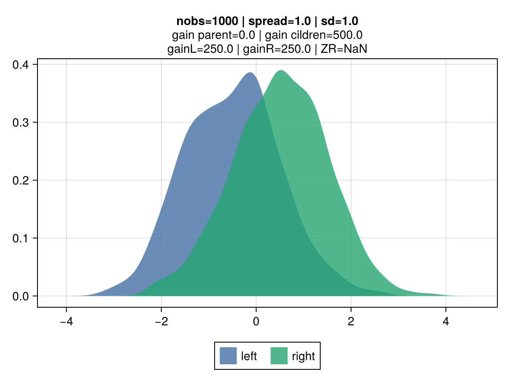
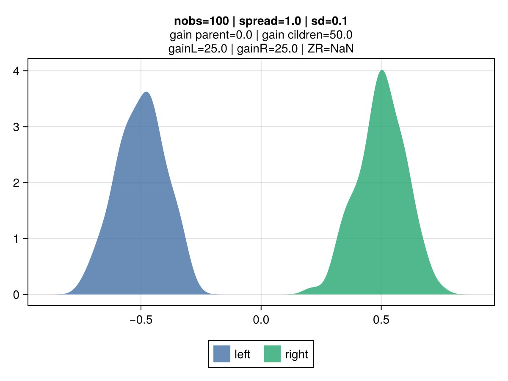
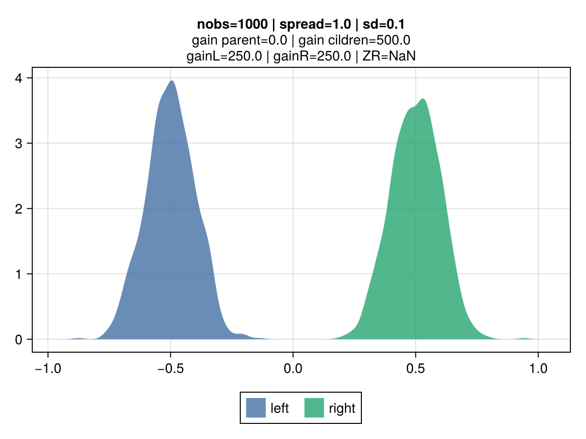
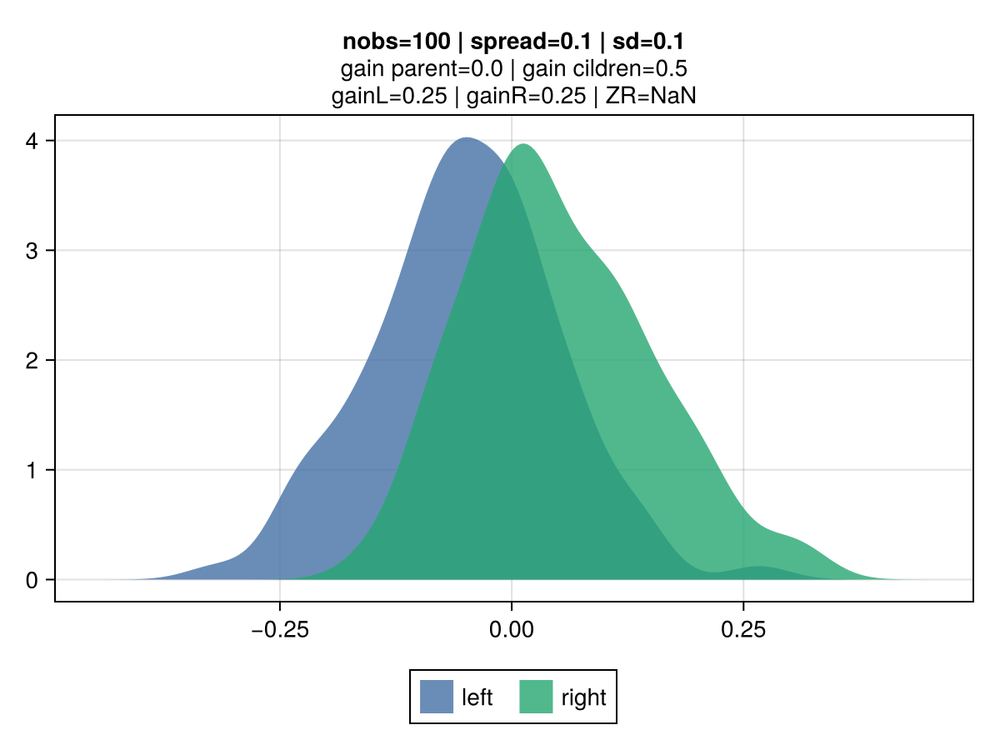
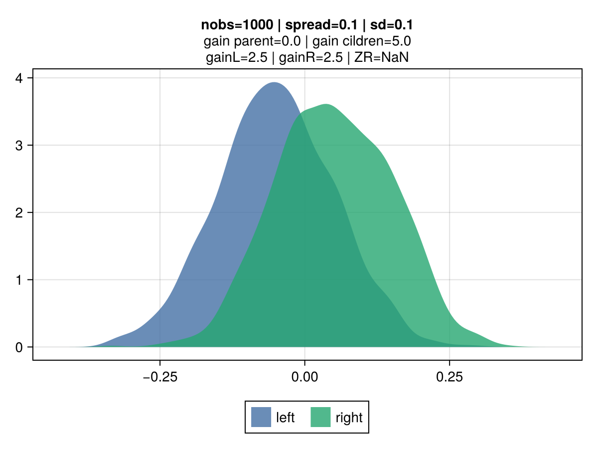
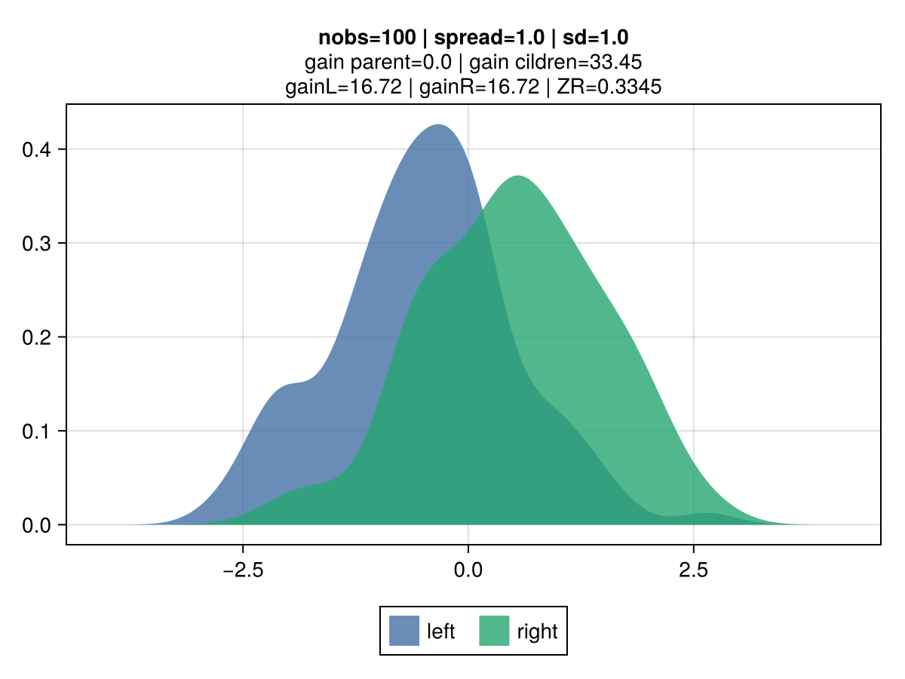
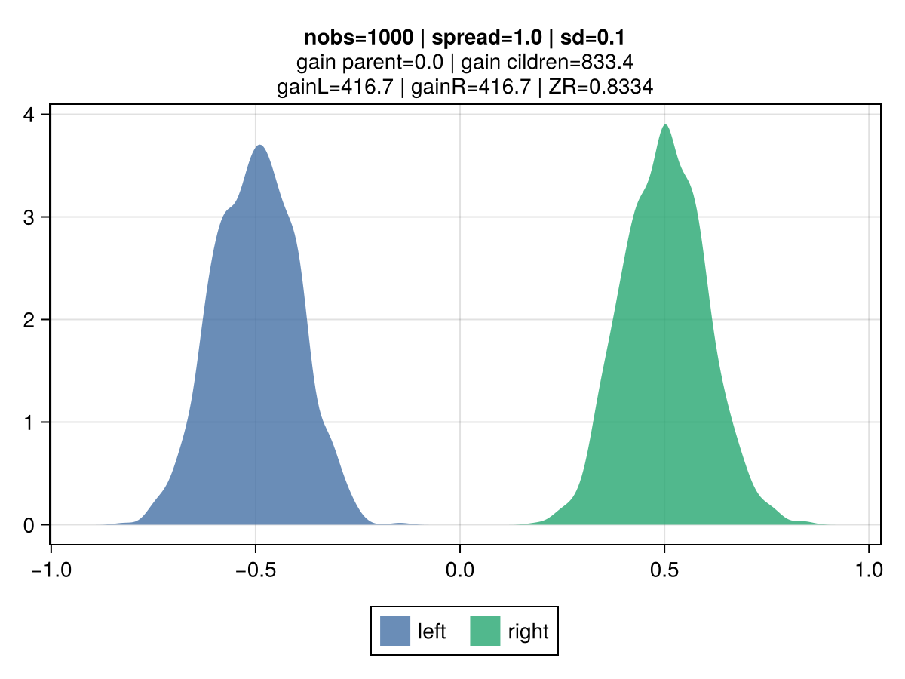
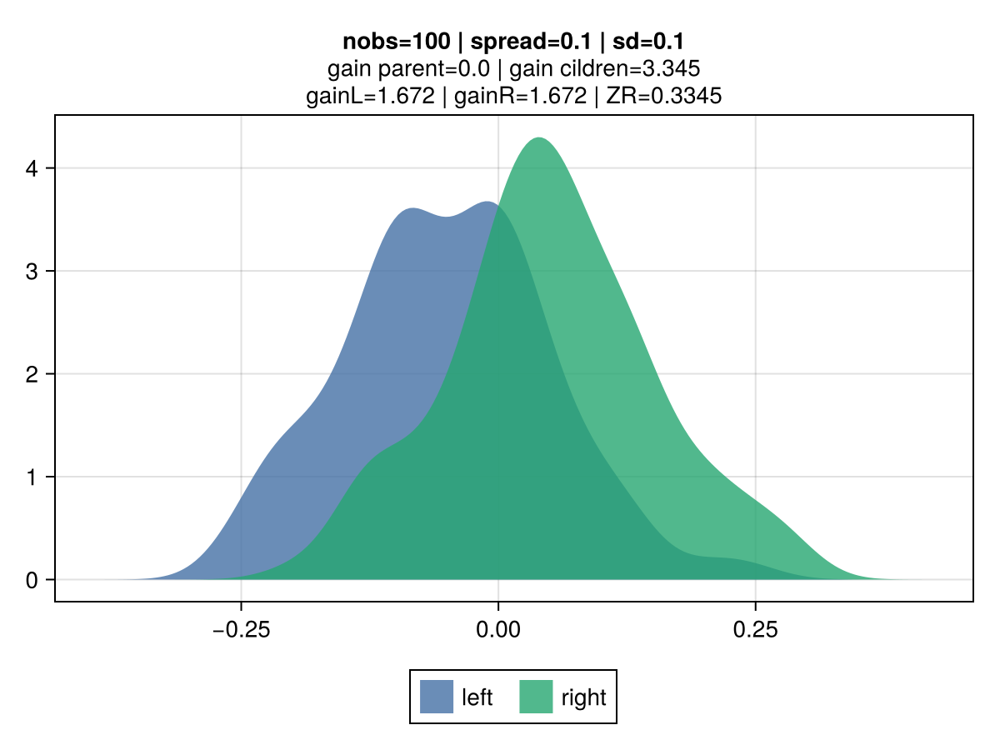
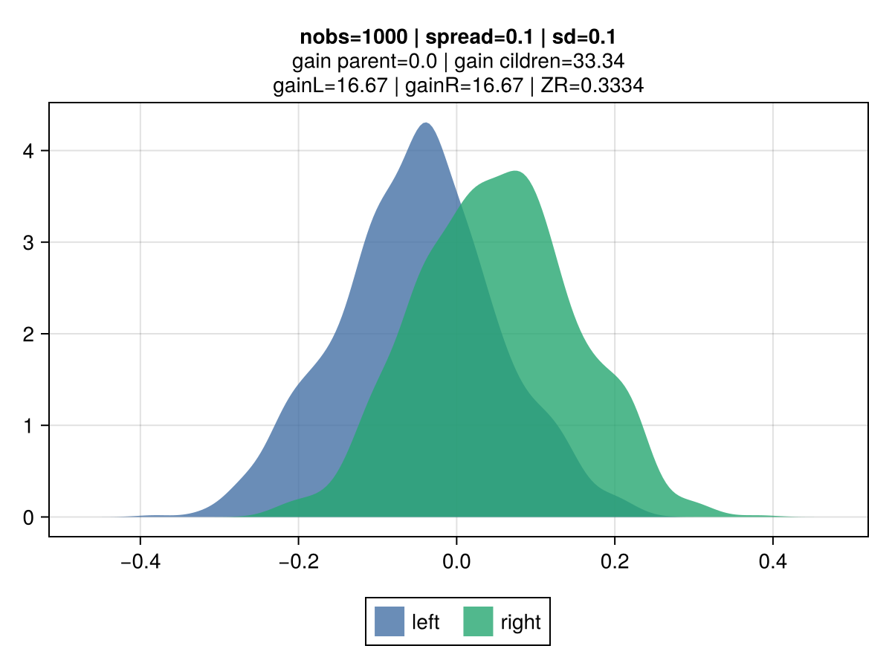

# Exploring a credibility-based approach for tree-gain estimation


> The motivation for this experiment was to explore an alternative to gradient-based gain measure by integrating the volatility of split candidates to identity the best node split.

## Review of MSE key characteristics

The figures below illustrate the behavior of vanilla gradient-based approach using a mean-squarred error (MSE) loss.
The 2 colors represent the observations belonging to the left and right children.
Key observations:
- **the gain is invariant to the volatility**: the top vs bottom figures differs only by the std dev of the observations.
    The associated gain is identical, which is aligned with the gradient-based approach to gain: the gain matches the reduction in the MSE, which is identical regardless of the dispersion. It's strictly driven by their mean.
- **the gain scales linearly with the number of observations**: the right vs left figures contrasts different number of observations (100 vs 10k), and show that gain is directly proportional.
- **the gain scales quadratically with the spread**: moving from a spread of 1.0 to 0.1 between the 2nd and 3rd row results in a drop by 100x of the gain: from 50.0 to 0.5.


|  |  |
|:----------------------:|:----------------------:|
|  |  |
|  |  |

## Credibility-based gains

The idea is for the *gain* to reflect varying uncertainty levels for observations associated to each of the tree-split candidates.
For tree-split candidates with an identical spread, the intuition is that candidates with a lower volatility, all other things being equal, should be preferred.
The original inspiration comes from credibility theory, a foundational notion in actuarial science with direct connexion mixed effect models and bayesian theory.
Key concept is that the credibility associated with a set of observations is driven by the relative effect of 2 components:
 - **Variance of the Hypothetical Means (VHM)**: if large differences between candidates means are expected, a greater credibility is assigned.
 - **Expected Value of the Process Variance (EVPV)**: if the data generation process of a given candidate has a large volatility, a smaller credibility is assigned.
The Buhlmann credibility states that the optimal linear posterior estimator of a group mean is:
 - `Z * X̄ + (1 - Z) * μ`, where `X̄` is the group mean and `μ` the population mean.

This approach results in a shift of perspective in how the gain is derived.
Classical gradient based is about deriving a second-order approximation of the loss curve for a tre-split candidate.
The gain corresponds to the reduction in this approximated loss by taking the prediciton that minimises the quadratic loss curve.
The credibility-based takes a loss function agnostic approach, and view the gain as the total absolute change in the credibility-adjusted predicted value.
Example, if a child has a mean residual of *2.0*, credibility of 0.5 and 100 observations, the resulting gain is: `2.0 * 0.5 * 100 = 100.0`, where `2.0 * 0.5` corresponds to the credibility adjusted prediction.

VHM is estimated as the square of the mean of the spread between observed values and predictions:
- `VHM = E[X] = mean(y - p)`

EVPV is estimated as the variance of the observations. This value can be derived from the aggregation of the first and second moment of the individual observations:
- `EVPV = E[(x - μ)²] = E[X²] - E²[X]`

Same as for the previous the gradient-based MSE error, the gain grows linearly with the number of observations, all other things being equal.
However, a smaller volatility results in an increased gain, as shown in 2nd vs 1st row.


|  |  |
|:----------------------:|:----------------------:|
|  |  |
|  |  |

## Credibility figures
Two credibility variations are tested:
 - **cred_var**: `VHM / (VHM + EVPV)`
 - **cred_std**: `sqrt(VHM) / (sqrt(VHM) + sqrt(EVPV))`
The figures below present the credibility factor associated with different spreads and number observations

### Simulation grid

The chart below show the associated credibility and gain for a given node split candidate for various spreads and standards deviations.

````julia
nobs = 1000
sd_list = [0.01, 0.05, 0.1, 0.2, 0.5, 1, 2, 5]
spread_list = [0.01, 0.05, 0.1, 0.2, 0.5, 1]
metric_name = "cred"
metric_name = "gain"
````

|  |  |
|:----------------------:|:----------------------:|

### Illustration of different cred-based decision compared to MSE:

Despite both `mse` and `cred_std` resulting in the same prediction, which matches the mean of the observations, the associated gain differs due to the volatility penalty.

The following illustrates a minimal scenario of 2 features, each with only 2 levels.

|  |  |
|:----------------------:|:----------------------:|

```julia
config = EvoTreeRegressor(loss=:mse, nrounds=1, max_depth=2)
model_mse = EvoTrees.fit(config, dtrain; target_name="y")

EvoTrees.Tree{EvoTrees.MSE, 1}
 - feat: [2, 0, 0]
 - cond_bin: UInt8[0x01, 0x00, 0x00]
 - gain: Float32[12113.845, 0.0, 0.0]
 - pred: Float32[0.0 -0.017858343 0.3391479]
 - split: Bool[1, 0, 0]
```

```julia
config = EvoTreeRegressor(loss=:cred_std, nrounds=1, max_depth=2)
model_std = EvoTrees.fit(config, dtrain; target_name="y")

EvoTrees.Tree{EvoTrees.CredStd, 1}
 - feat: [1, 0, 0]
 - cond_bin: UInt8[0x02, 0x00, 0x00]
 - gain: Float32[8859.706, 0.0, 0.0]
 - pred: Float32[0.0 0.07375729 -0.07375729]
 - split: Bool[1, 0, 0]
```

## Results
From [MLBenchmarks.jl](https://github.com/Evovest/MLBenchmarks.jl).
| **model** | **metric** | **MSE** | **credV1A** | **credV2A** | **credV1B** | **credV2B** |
|:---------:|:----------:|:-------:|:-----------:|:-----------:|:-----------:|:-----------:|
| boston    | mse        | 6.3     | 6.18        | 6.01        | 6.47        | 6.18        |
| boston    | gini       | 0.945   | 0.948       | 0.953       | 0.949       | 0.944       |
| year      | mse        | 74.9    | 78.3        | 74.3        | 77.6        | 76.9        |
| year      | gini       | 0.662   | 0.645       | 0.667       | 0.653       | 0.651       |
| msrank    | mse        | 0.55    | 0.56        | 0.55        | 0.552       | 0.552       |
| msrank    | ndcg       | 0.511   | 0.499       | 0.509       | 0.509       | 0.509       |
| yahoo     | mse        | 0.565   | 0.587       | 0.569       | missing     | missing     |
| yahoo     | ndcg       | 0.795   | 0.787       | 0.793       | missing     | missing     |

