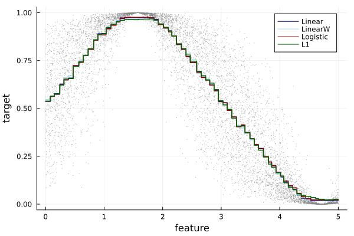
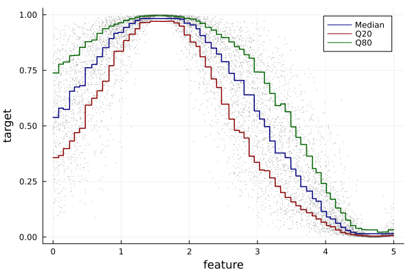
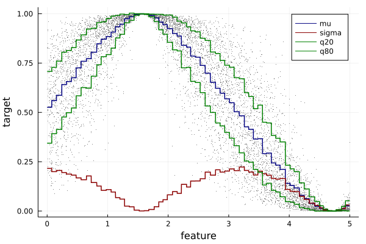

# Internal API examples

The following provides minimal examples of usage of the various loss functions available in EvoTrees using the internal API.

## Regression

Minimal example to fit a noisy sinus wave.



```julia
using EvoTrees
using EvoTrees: sigmoid, logit

# prepare a dataset
features = rand(10000) .* 20 .- 10
X = reshape(features, (size(features)[1], 1))
Y = sin.(features) .* 0.5 .+ 0.5
Y = logit(Y) + randn(size(Y))
Y = sigmoid(Y)
𝑖 = collect(1:size(X, 1))

# train-eval split
𝑖_sample = sample(𝑖, size(𝑖, 1), replace = false)
train_size = 0.8
𝑖_train = 𝑖_sample[1:floor(Int, train_size * size(𝑖, 1))]
𝑖_eval = 𝑖_sample[floor(Int, train_size * size(𝑖, 1))+1:end]

x_train, x_eval = X[𝑖_train, :], X[𝑖_eval, :]
y_train, y_eval = Y[𝑖_train], Y[𝑖_eval]

params1 = EvoTreeRegressor(
    loss=:linear, metric=:mse,
    nrounds=100, nbins = 100,
    lambda = 0.5, gamma=0.1, eta=0.1,
    max_depth = 6, min_weight = 1.0,
    rowsample=0.5, colsample=1.0)

model = fit_evotree(params1; x_train, y_train, x_eval, y_eval, print_every_n = 25)
pred_eval_linear = predict(model, x_eval)

# logistic / cross-entropy
params1 = EvoTreeRegressor(
    loss=:logistic, metric = :logloss,
    nrounds=100, nbins = 100,
    lambda = 0.5, gamma=0.1, eta=0.1,
    max_depth = 6, min_weight = 1.0,
    rowsample=0.5, colsample=1.0)

model = fit_evotree(params1; x_train, y_train, x_eval, y_eval, print_every_n = 25)
pred_eval_logistic = predict(model, x_eval)

# L1
params1 = EvoTreeRegressor(
    loss=:L1, alpha=0.5, metric = :mae,
    nrounds=100, nbins=100,
    lambda = 0.5, gamma=0.0, eta=0.1,
    max_depth = 6, min_weight = 1.0,
    rowsample=0.5, colsample=1.0)

model = fit_evotree(params1; x_train, y_train, x_eval, y_eval, print_every_n = 25)
pred_eval_L1 = predict(model, x_eval)
```

## Poisson Count

```julia
# Poisson
params1 = EvoTreeCount(
    loss=:poisson, metric = :poisson,
    nrounds=100, nbins = 100,
    lambda = 0.5, gamma=0.1, eta=0.1,
    max_depth = 6, min_weight = 1.0,
    rowsample=0.5, colsample=1.0)

model = fit_evotree(params1; x_train, y_train, x_eval, y_eval, print_every_n = 25)
pred_eval_poisson = predict(model, x_eval)
```

## Quantile Regression



```julia
# q50
params1 = EvoTreeRegressor(
    loss=:quantile, alpha=0.5, metric = :quantile,
    nrounds=200, nbins = 100,
    lambda = 0.1, gamma=0.0, eta=0.05,
    max_depth = 6, min_weight = 1.0,
    rowsample=0.5, colsample=1.0)

model = fit_evotree(params1; x_train, y_train, x_eval, y_eval, print_every_n = 25)
pred_train_q50 = predict(model, x_train)

# q20
params1 = EvoTreeRegressor(
    loss=:quantile, alpha=0.2, metric = :quantile,
    nrounds=200, nbins = 100,
    lambda = 0.1, gamma=0.0, eta=0.05,
    max_depth = 6, min_weight = 1.0,
    rowsample=0.5, colsample=1.0)

model = fit_evotree(params1; x_train, y_train, x_eval, y_eval, print_every_n = 25)
pred_train_q20 = predict(model, x_train)

# q80
params1 = EvoTreeRegressor(
    loss=:quantile, alpha=0.8,
    nrounds=200, nbins = 100,
    lambda = 0.1, gamma=0.0, eta=0.05,
    max_depth = 6, min_weight = 1.0,
    rowsample=0.5, colsample=1.0)

model = fit_evotree(params1; x_train, y_train, x_eval, y_eval, print_every_n = 25)
pred_train_q80 = predict(model, x_train)
```

## Gaussian Max Likelihood



```julia
params1 = EvoTreeMLE(
    loss=:gaussian_mle, metric=:gaussian_mle,
    nrounds=100, nbins=100,
    lambda = 0.0, gamma=0.0, eta=0.1,
    max_depth = 6, min_weight = 1.0,
    rowsample=0.5, colsample=1.0, seed=123)
```